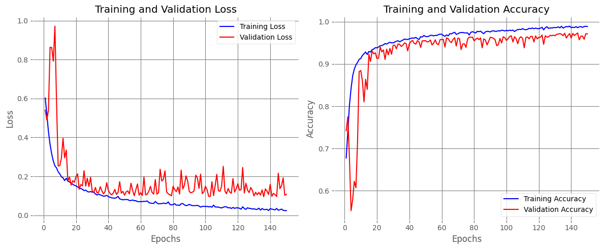
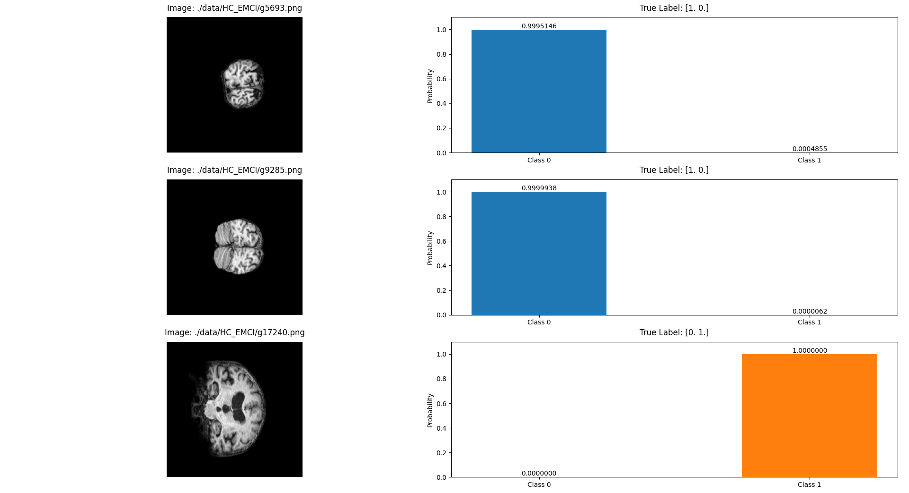
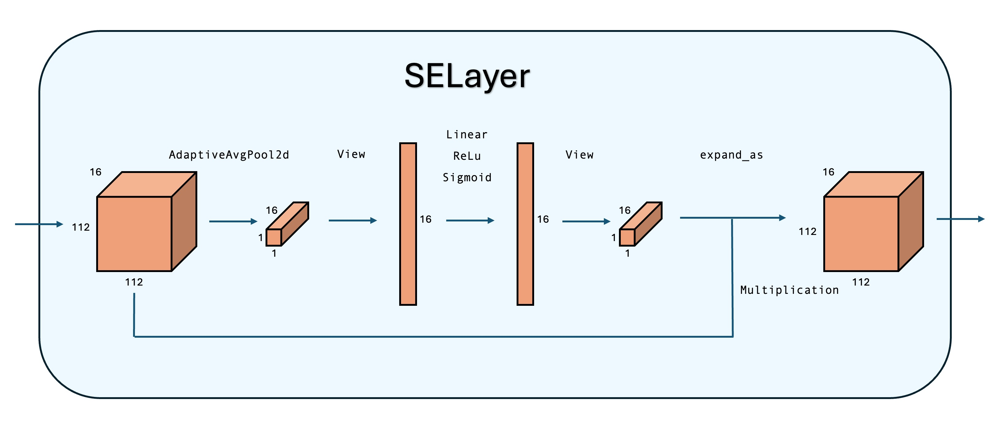
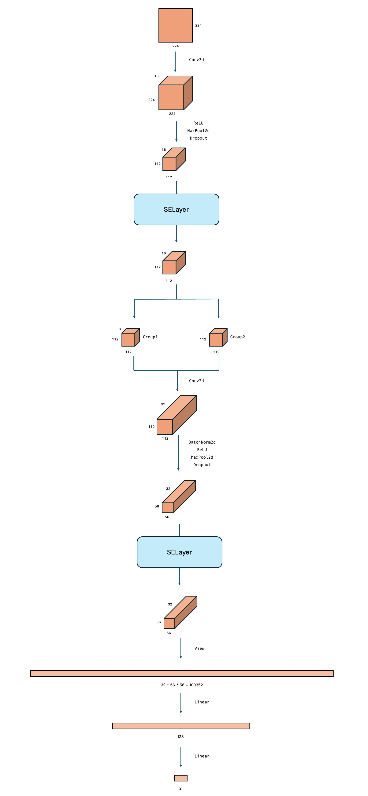

# SECatNet


## 环境准备：
```bash
pip install -r requirements.txt
```
## 启动训练：（以 `HC_EMCI` 数据集为例）
```bash
# MacOS
./start_training.sh --data_dir './data/HC_EMCI' --labels_dir './labels/EMCI_HCtrain_list.xlsx' --verbose
# Linux/Windows
./start_training.bat --data_dir './data/HC_EMCI' --labels_dir './labels/EMCI_HCtrain_list.xlsx' --verbose
```

## 结果演示：
```bash
python forward.py --model './model/HC_EMCI.pth' --data_folder './data/HC_EMCI' --label_dir './labels/EMCI_HCtrain_list.xlsx'
```


## 模型结构：

> 参考论文： 
> 
> se模块：https://openaccess.thecvf.com/content_cvpr_2018/papers/Hu_Squeeze-and-Excitation_Networks_CVPR_2018_paper.pdf
> 
> 分组卷积：https://papers.nips.cc/paper/2012/file/c399862d3b9d6b76c8436e924a68c45b-Paper.pdf

SELayer是一个实现通道注意力机制的神经网络模块，其核心作用是通过动态调整各通道的权重，增强模型对重要特征的关注，从而提升网络性能。
- 流程：
  - Squeeze阶段：使用nn.AdaptiveAvgPool2d(1)进行全局平均池化，将每个通道的空间维度压缩为1x1，捕获通道的全局信息。
  - Excitation阶段：通过包含两个全连接层的瓶颈结构（第一个降维，第二个恢复维度），结合ReLU和Sigmoid激活函数，生成0-1之间的通道权重。
  - Scale阶段：将学习到的通道权重与原始输入逐通道相乘，完成特征重标定。
- 核心作用：
  - 通道注意力机制：显式建模通道间的依赖关系，自动学习各通道的重要性权重。
  - 特征重标定：增强重要特征通道的响应，抑制不相关或噪声通道。
  - 即插即用：可灵活嵌入到CNN架构中（如ResNet的残差块），提升模型表达能力。



secatnet结构：

## 项目目录结构：
```
SECatNet
·
├── README.md
├── data  # 数据集
│   ├── AD_EMCI
│   ├── AD_HC
│   └── HC_EMCI
├── labels  # 标签集
│   ├── AD_EMCItrain_list.xlsx
│   ├── AD_HCtrain_list.xlsx
│   └── EMCI_HCtrain_list.xlsx
├── model  # 模型
│   └── HC_EMCI.pth
├── result  # 可视化结果
│   ├── Figure_1.png
│   └── HC_EMCI.png
├── src
│   ├── dataset.py  # 数据集结构
│   ├── secatnet.py  # 模型结构
│   ├── train.py  # 模型训练
│   └── visualization.py  # 可视化
├── forward.py  # 推理脚本
├── main.py  # 训练主入口
├── requirements.txt  # 依赖
├── start_training.bat  # Windows启动脚本
└── start_training.sh  # MacOS启动脚本
```